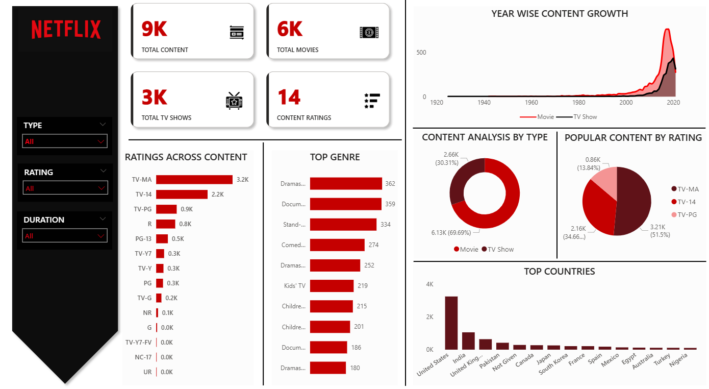

# Netflix Content Analysis Dashboard

This project explores and visualizes global Netflix content data to uncover trends in genres, content types, and release patterns. The dataset was cleaned and prepared using Python, and insights were visualized in Power BI.

---

## Tools & Technologies Used

- **Python** – Data cleaning and preprocessing
- **Power BI** – Interactive visualizations and dashboards
- **Jupyter Notebook** – Python scripting
- **CSV Dataset** – Netflix content data (titles, genres, years, etc.)

---

## Key Features

- Cleaned and transformed Netflix dataset using Python (handled nulls, split genres, standardized fields)
- Analyzed:
  - TV Shows vs Movies distribution
  - Top genres and their growth over time
  - Country-wise content production
  - Year-wise release trends
  - Most frequent ratings and directors
- Built a **fully interactive Power BI dashboard** with:
  - Filters for Genre, Country, Type, Rating
  - KPI cards for total titles, most active years, top genres

---

## Dashboard Preview

---

## Outcome

- Delivered a comprehensive view of Netflix’s global content strategy through data-driven insights.
- Empowered exploration of genre trends, content type distributions, and release year patterns.
- Created a clean and insightful Power BI dashboard ready for presentation or portfolio use.

---

## Next Steps

- Integrate IMDb or Rotten Tomatoes ratings for quality-based content analysis
- Compare Netflix trends with other streaming platforms (like Prime or Disney+)

---
